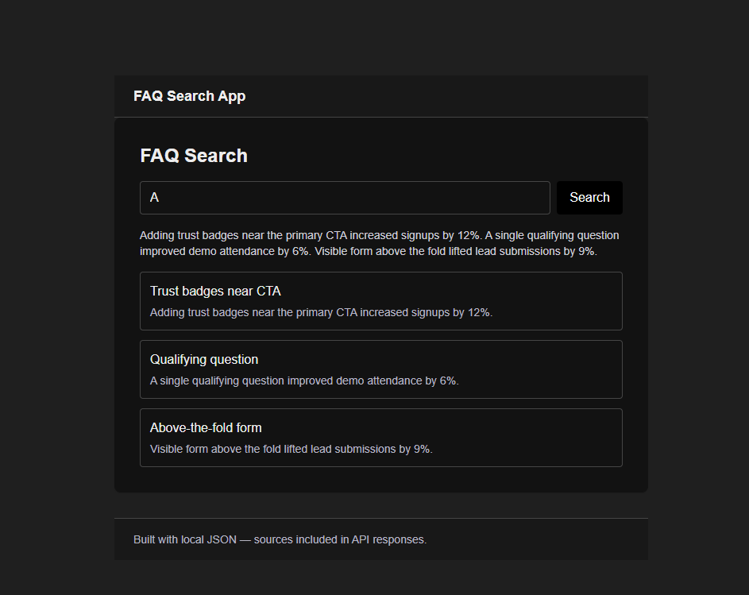

# FAQ Search — Next.js (TypeScript) — Local JSON

This repository is a Next.js + TypeScript app that exposes a single POST API endpoint (`/api/search`) backed by a local JSON dataset (`data/faqs.json`) and a responsive Tailwind-based UI. It is intentionally minimal and useful as an example of building a local-search API without external services.



## What this project provides

- A local dataset: `data/faqs.json` (5 sample FAQ items).
- Server API: `POST /api/search` — validates the request with `zod`, runs a lightweight keyword-based scoring algorithm, and returns the top matches along with a combined summary and source ids.
- Frontend: `src/pages/index.tsx` — responsive UI built with Tailwind CSS. Search input, results list, summary/sidebar, accessible focus handling, and light framer-motion animation for the button.
- Tests: a small Jest test verifying search behavior (`src/lib/search.test.ts`).
- Dockerfile: multi-stage image for build and production runtime.

## Quick start (development)

Requirements:

- Node.js 20+ (the Dockerfile uses Node 20 image)

Install dependencies:

```powershell
npm i
```

Run the development server (hot reload):

```powershell
npm run dev
```

Open http://localhost:3000

Scripts in `package.json`:

- `dev` — next dev (development server)
- `build` — build for production
- `start` — start the built production server (`next start`)
- `test` — run Jest tests

## API: POST /api/search

Endpoint: `/api/search`

Request (JSON):

```json
{ "query": "some search terms" }
```

Response (200 OK) on match:

```json
{
  "results": [{ "id": "1", "title": "...", "snippet": "..." }],
  "summary": "Combined short summary of top matches",
  "sources": ["1", "3"]
}
```

Validation and errors:

- The API uses `zod` to trim and validate the `query` string. Empty or whitespace-only queries return a 400 with a structured error:

```json
{ "error": { "message": "Query must not be empty", "code": "invalid_request" } }
```

Notes:

- The API is intentionally simple — it loads `data/faqs.json` from disk on each request and performs a tokenized count-based scoring with title-weighting. This is suitable for small datasets but not for large-scale use.

## Frontend notes

- The UI is in `src/pages/index.tsx`. It is responsive:
  - Mobile: stacked input and button, single column.
  - Desktop (md+): two-column layout where the left column contains search and results and the right column shows summary and sources.
- The Search button currently triggers the search; Enter works in the input as well.
- Accessibility: the first result is focused for keyboard users when results arrive; status messages use `aria-live`.

## Architecture and code layout

- `data/faqs.json` — local dataset
- `src/lib/search.ts` — core search logic (scoring, snippet, summary)
- `src/pages/api/search.ts` — API route: request validation (zod) + calls into `searchFaqs`
- `src/pages/index.tsx` — responsive frontend using Tailwind and framer-motion
- `src/components/Header.tsx` and `Footer.tsx` — minimal layout pieces
- `src/types/index.ts` — central TypeScript types

## Design choices and assumptions

- No external full-text search engine — the dataset is small and searched in-process.
- Title matches are weighted higher in the scoring algorithm (titleCount \* 3 + bodyCount).
- The API trims queries before validation so whitespace-only input is rejected consistently.
- The app reads `data/faqs.json` synchronously at request time. This is simple and predictable for small files; for larger datasets or production use, change to a caching strategy or a proper datastore.

## Docker

Build and run the included multi-stage Dockerfile (uses Node 20):

```powershell
docker build -t retrieve-local-json-next:latest .
docker run --rm -p 3000:3000 retrieve-local-json-next:latest
```

The project contains a `.dockerignore` that excludes `node_modules`, `.next`, and other build artifacts.

## Tests

Run unit tests:

```powershell
npm run test
```

The repository includes a basic test `src/lib/search.test.ts` which asserts that the `searchFaqs` function returns the expected shape and that a specific query ranks the expected item highest.

## Cleanup and gitignore guidance

- This repo currently includes generated `.next` build artifacts while developing. Do not commit `.next` or `node_modules` — add them to `.gitignore`.
- The repository already has a `.dockerignore` that excludes `.next` and `node_modules` from Docker build contexts.

## Next improvements

- Implement caching for the dataset to avoid reading the JSON file on each request.
- Add more unit and integration tests (API-level tests, edge cases like ties, long queries, and 0-result responses).
- Add highlighting of matched terms in the UI and more explicit ranking details.
- Add pagination or a configurable `limit` parameter in the API.

## Contact & author

Author: Rahmad Alamsyah Nazaruddin <nzr.rahmad@gmail.com>

If you want any of the suggested improvements implemented or prefer a different Docker base (Alpine, etc.), tell me which one and I’ll update the repo accordingly.

## Deploy on Vercel

The easiest way to deploy your Next.js app is to use the [Vercel Platform](https://vercel.com/new?utm_medium=default-template&filter=next.js&utm_source=create-next-app&utm_campaign=create-next-app-readme) from the creators of Next.js.

Check out our [Next.js deployment documentation](https://nextjs.org/docs/pages/building-your-application/deploying) for more details.
